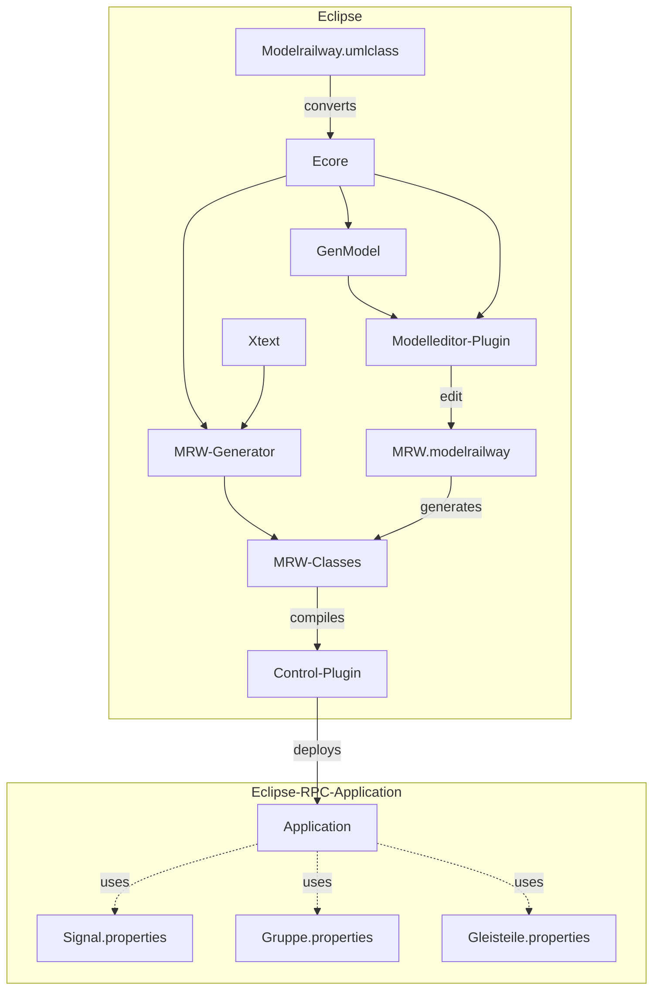

# Modell(-bau-)basierte Eisenbahnsteuerung

Herzlich Willkommen auf den Informationsseiten der modell(-bau-)basierten
Eisenbahnsteuerung! Auf diesen Seiten wird die Entwicklung einer
eigenständig entwickelten Eisenbahnsteuerung dargestellt. Alle Ergebnisse
können auf diesen Seiten als Open Source (Eclipse Public Licence) eingesehen
werden. Schaut Euch den Quellcode an und nehmt Einblick in die
technischen Hintergründe des CAN-Bus und Microcontroller-Programmierung mit
dem ATmega32. Die ausführliche API bietet weiteres Hintergrundmaterial.
Schauen Sie sich auch die vielen
[Videos auf YouTube](https://www.youtube.com/playlist?list=PL6E0B186E9CC98026) an!

Viel Spaß!!

## Build- und Modellarchitektur

